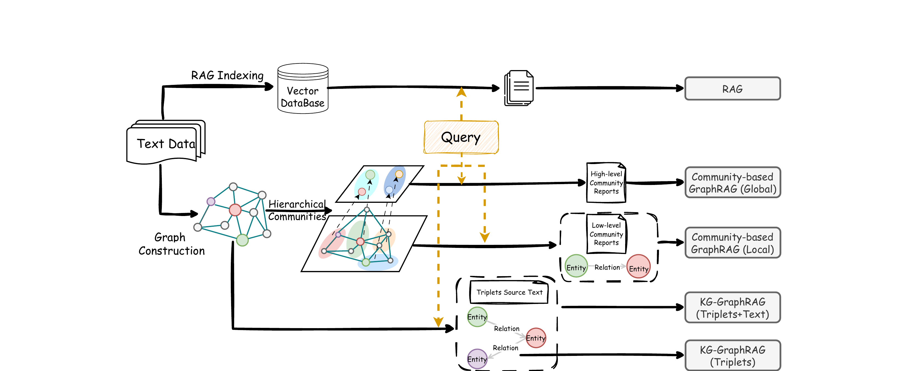

# Hybrid RAG

Программная реализация гибридной системы Retrieval-Augmented Generation (RAG), объединяющей векторный (semantic similarity) и графовый (knowledge graph) методы поиска для повышения качества ответов больших языковых моделей на вопросы по заданному корпусу документов.

Архитектура системы основана на подходе, описанном в статье [RAG vs. GraphRAG: A Systematic Evaluation and Key Insights](https://arxiv.org/abs/2502.11371v1) (Han et al., 2025). Авторы показывают, что RAG и GraphRAG обладают взаимодополняющими сильными сторонами: векторный RAG лучше работает на вопросах, где ответ содержится в одном фрагменте текста, тогда как GraphRAG эффективнее на multi-hop вопросах, требующих рассуждений по цепочкам связей между сущностями. Гибридная интеграция обоих подходов позволяет улучшить результаты на задачах, где ни один из методов не доминирует в одиночку.



*Figure 1 из (Han et al., 2025): иллюстрация RAG, KG-based GraphRAG и Community-based GraphRAG. В данной реализации используются ветки RAG (верхняя) и KG-GraphRAG (Triplets+Text).*

## Компоненты системы

| Метод | Реализация | Применение |
|-------|-----------|------------|
| Vector RAG | ChromaDB + SentenceSplitter / MarkdownNodeParser | Фактические вопросы, ответ в одном фрагменте |
| Graph RAG | LlamaIndex PropertyGraphIndex (извлечение триплетов) | Multi-hop вопросы, рассуждения по связям между сущностями |
| Hybrid | Объединение и дедупликация результатов обоих методов | Смешанные запросы |

## Установка

```bash
pip install -r requirements.txt
```

## Конфигурация

```bash
cp config.example.yaml config.yaml
```

```yaml
llm:
  model: "gpt-4o-mini"
  base_url: "https://api.openai.com/v1"

embedding:
  model: "text-embedding-3-small"
  base_url: "https://api.openai.com/v1"

vector:
  chunk_size: 256
  chunk_overlap: 50
  top_k: 10

graph:
  max_triplets_per_chunk: 10
  similarity_top_k: 10
```

```bash
export OPENAI_API_KEY="sk-..."
```

## Использование

### 1. Подготовка документов

Поддерживаемые форматы:
- `.txt` — plain text
- `.md` — markdown (парсится по заголовкам)
- `.json` — структурированный формат

JSON формат:
```json
[
  {"id": "doc1", "title": "Title", "content": "Document text..."},
  {"id": "doc2", "title": "Title 2", "content": "Another document..."}
]
```

### 2. Индексация

```bash
# Все индексы (vector + graph)
python -m hybrid_rag index \
  --input ./documents/ \
  --output ./indexes/ \
  --config config.yaml \
  --type all

# Только векторный индекс
python -m hybrid_rag index -i ./documents/ -o ./indexes/ -t vector

# Только графовый индекс
python -m hybrid_rag index -i ./documents/ -o ./indexes/ -t graph
```

### 3. Проверка статуса

```bash
python -m hybrid_rag status --index-dir ./indexes/
```

### 4. Запуск сервера

```bash
python -m hybrid_rag serve --index-dir ./indexes/ --port 8000

# UI (Streamlit) — в отдельном терминале
streamlit run hybrid_rag/ui/app.py
```

### 5. Запросы

```bash
curl -X POST http://localhost:8000/query \
  -H "Content-Type: application/json" \
  -d '{"query": "What is...?", "method": "hybrid"}'
```

Методы поиска:
- `vector` — только векторный поиск
- `graph` — только графовый поиск
- `hybrid` — оба метода

## Docker

### Индексация (локально)

```bash
python -m hybrid_rag index -i ./documents/ -o ./indexes/
```

### Перенос на сервер

```bash
rsync -av ./indexes/ server:/app/indexes/
```

### Запуск

```bash
echo "OPENAI_API_KEY=sk-..." > .env

docker compose up -d
```

Сервисы:
- API: http://localhost:8000
- Swagger: http://localhost:8000/docs
- UI: http://localhost:8501


## Ссылки

- Han, H., Shomer, H., Wang, Y., Lei, Y., Guo, K., Hua, Z., Long, B., Liu, H., & Tang, J. (2025). *RAG vs. GraphRAG: A Systematic Evaluation and Key Insights*. arXiv:2502.11371. https://arxiv.org/abs/2502.11371
